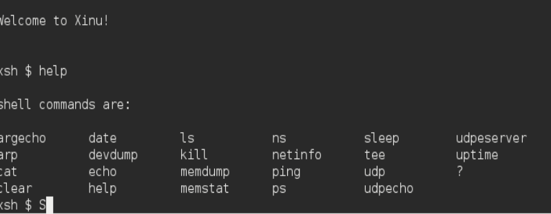
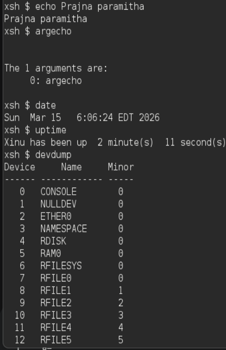
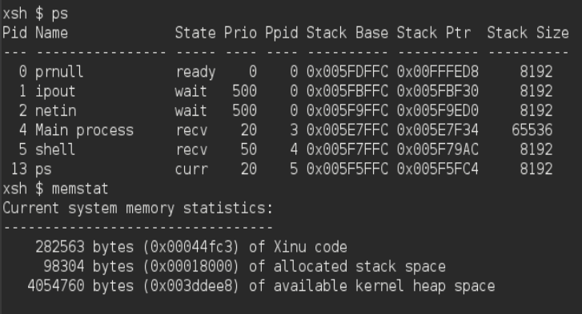
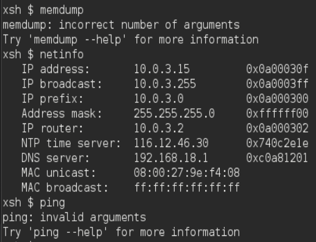
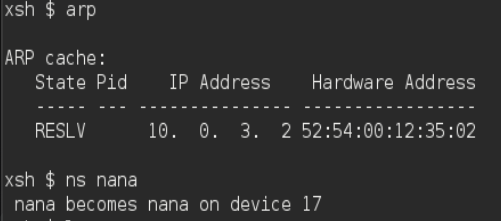
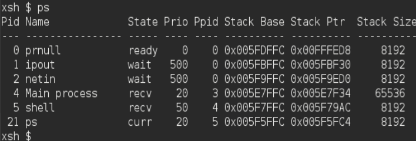

# <h1 align="center">Laporan Praktikum Modul 3  Explorasi Xinu </h1>

Prajna Paramitha Wardhany - 2311104016

## Dasar Teori
XINU
XINU ("X is Not Unix") adalah kernel sistem operasi komputer yang dikembangkan di Apple Inc. sejak Desember 1996 untuk digunakan dalam sistem operasi Mac OS X (sekarang macOS) dan dirilis sebagai perangkat lunak bebas dan sumber terbuka sebagai bagian dari OS Darwin

1. Perintah - perintah yang ada pada xinu:
- help : untuk menampilkan semua daftar perintah pada xinu 
- clear : membersikan layar terminal dari tekx sebelumnya
- echo : menampilkan text 
- argecho : menampilkan argumen yg di forward ke program 
- date : menampilkan tanggal dan waktu sistem 
- uptime : menampilkan informasi seberapa lama os xinu aktif 
- sleep : sleep mode xinu
- devdump : menampilkan daftar perangkat yang terdaftar di xinunya 
- ps : menampilkan tabel proses yang sedang berjalan di xinu 
- kill : menghentikan suatu proses secara paksa
- memstat : meampilkan statistik memori secara umum
- memdump : menampilkan daftar blok memori yg free
- netinfo : menampilkan informasi konfigurasi jaringan sistem xinu 
- ping : mengirimkan paket icmp
- arp : menampilkan tabel address
- ns : name server
- udp : perintah dasar untuk menguji koneksi menggunakan UDP
- udpecho : menjalankan program client UDP 
- udpeserver : menjalankan server udp
- ls : menampilkan daftar file dan direktori
- cat : membaca isi dari sebuah file
- tee : membaca input yang diketikkan dan nyimpen ke dalam sebuah file

2. Jawablah pertanyaan-pertanyaan berikut ini: 
    - Berapa jumlah perintah pada Xinu? **answer : 22**
    - Sebutkan 2 perintah yang mempunyai fungsi yang sama! **answer : perintah "help" dan "?". keduanya sama" buat menampilkan daftar perintah xinu** 
    - Berapa IP address Xinu? **answer : 10.0.3.15**
    - Perintah apa yang digunakan untuk mengetahui IP address? **answer : "netinfo"**
    - Berapa IP DNS server yang digunakan oleh Xinu? **answer: IP DNS 192.168.18.1**
    - Terdapat berapa proses yang sedang berjalan pada Xinu? **answer:6**
    - Proses apa yang mempunyai prioritas paling rendah? **answer : proses prnull** 
    - Proses apa yang mempunyai ukuran paling besar? **asnwer : proses main process**
    - Proses apa yang berada dalam state current? **answer : proses ps**
    - Proses apa yang berada dalam state suspend? **answer : ngga ada roses yang berada dalam state susped, buat cek jawabannya ada di ss guided**
    - Berapa PID (Process ID) dari Main process? **answer : PID main processnya 4**

## Guided
MODUL 3 - Menjawab pertanyaan

1. Jalankan Xinu OS, kemudian eksekusi perintah-perintah yang tersedia pada Shell Xinu. Selanjutnya, uraikan serta jelaskan fungsi dari setiap perintah yang terdapat di dalam Xinu! Perintah “help” => untuk menampilkan semua perintah pada Xinu 

  

## Referensi

1. https://share.google/di5IoOeGs83Fkxl0c (oracle vm virtual box)
2. https://id.wikipedia.org/wiki/XNU (xinu)