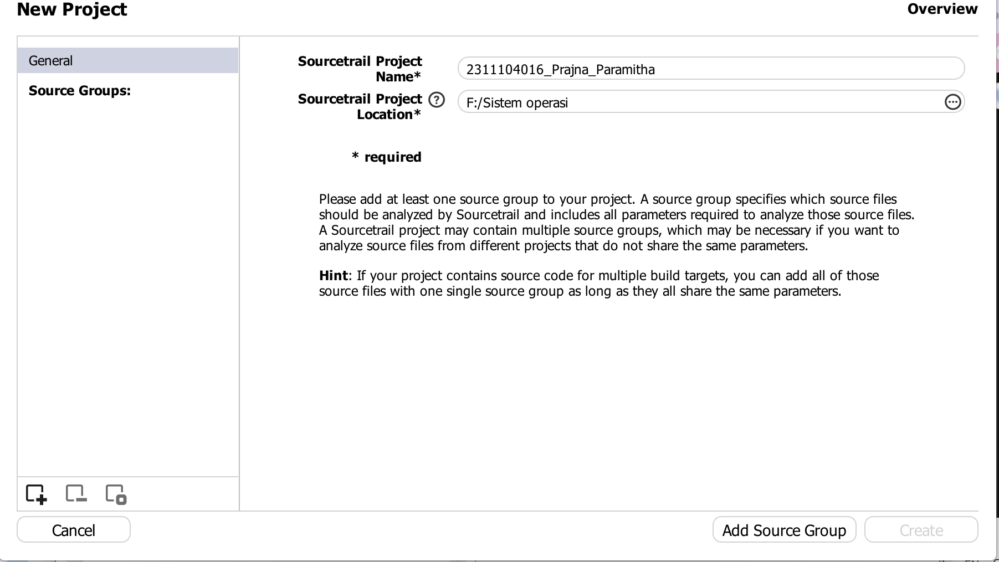
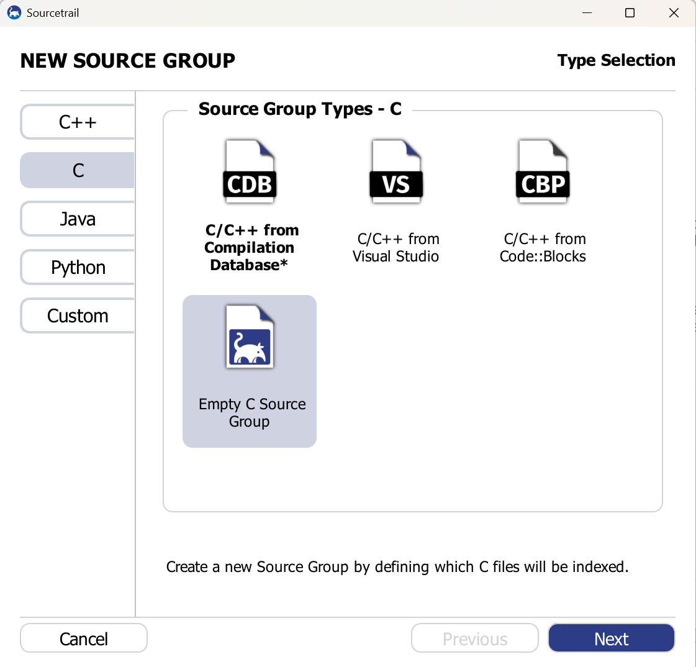
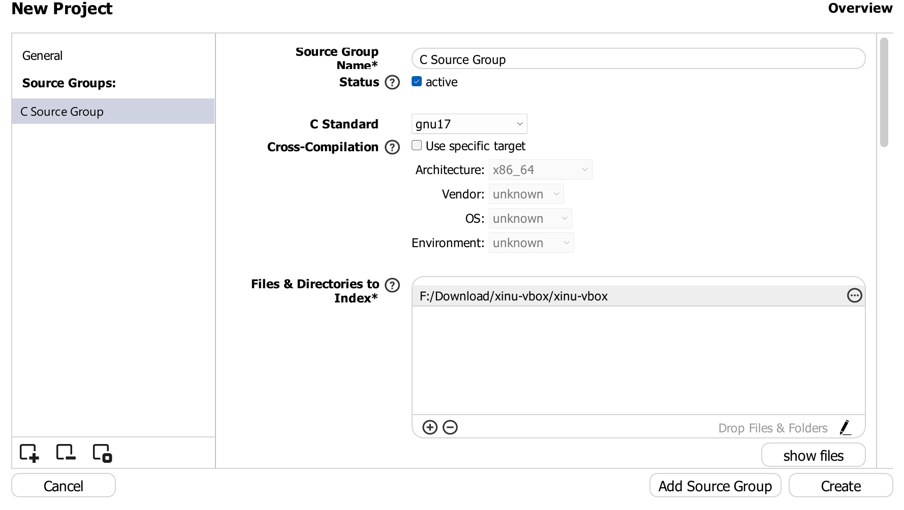
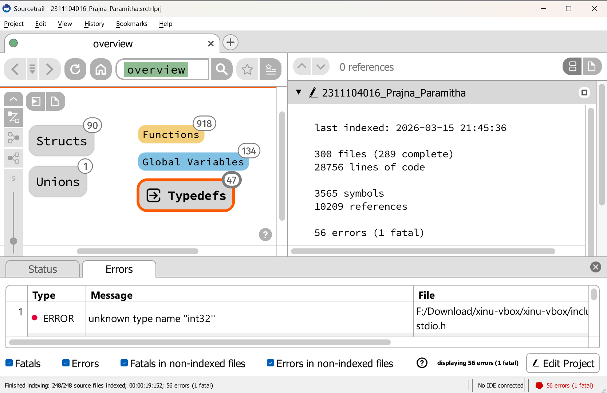
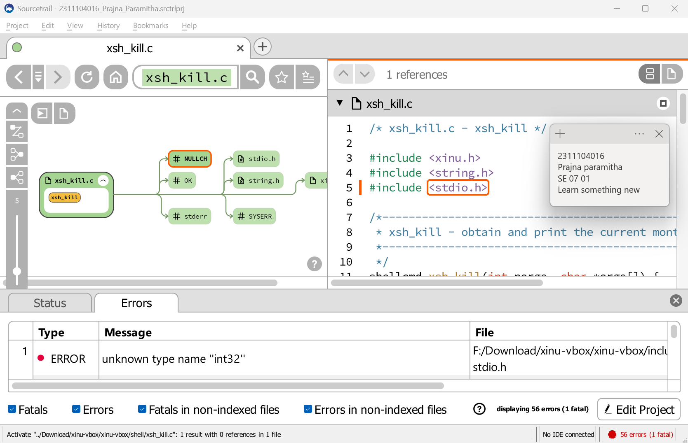

# <h1 align="center">Laporan Praktikum Modul 4  Membaca Source Code Xinu </h1>

Prajna Paramitha Wardhany - 2311104016

## Dasar Teori
XINU
XINU ("X is Not Unix") adalah kernel sistem operasi komputer yang dikembangkan di Apple Inc. sejak Desember 1996 untuk digunakan dalam sistem operasi Mac OS X (sekarang macOS) dan dirilis sebagai perangkat lunak bebas dan sumber terbuka sebagai bagian dari OS Darwin

Tujuan:
1.	Mahasiswa mampu membaca dan memahami struktur source code Xinu.
2.	Mahasiswa mampu melakukan modifikasi sederhana pada Xinu.

Catatan:
1.	Praktikan wajib untuk screenshot setiap langkah yang dikerjakan hingga tampilan output akhir.
2.	Untuk soal source code, kumpulkan SS-nya saja.
3.	Praktikan wajib untuk melakukan screenshot lengkap dengan nama root. Contoh: root@username.
4.	Berikan identitas nama - nim dalam bentuk comment di Source Code.
5.	Harap kerjakan secara mandiri, jika tidak paham silahkan bertanya kepada Asisten Praktikum masing-masing. Dilarang mengcopy jawaban dan source code dari teman!

## Guided
1. step 1 create new project

2. Step 2 Pilih tipe source group nya

3. Step 3 Menambahkan file direct ke arah folder extract vbox nya, terus auto detect inclde paths

4. Step 4 Project berhasil dibuat

5. Step 5 SS nama nim

## Referensi

1. https://share.google/di5IoOeGs83Fkxl0c (oracle vm virtual box)
2. https://id.wikipedia.org/wiki/XNU (xinu)