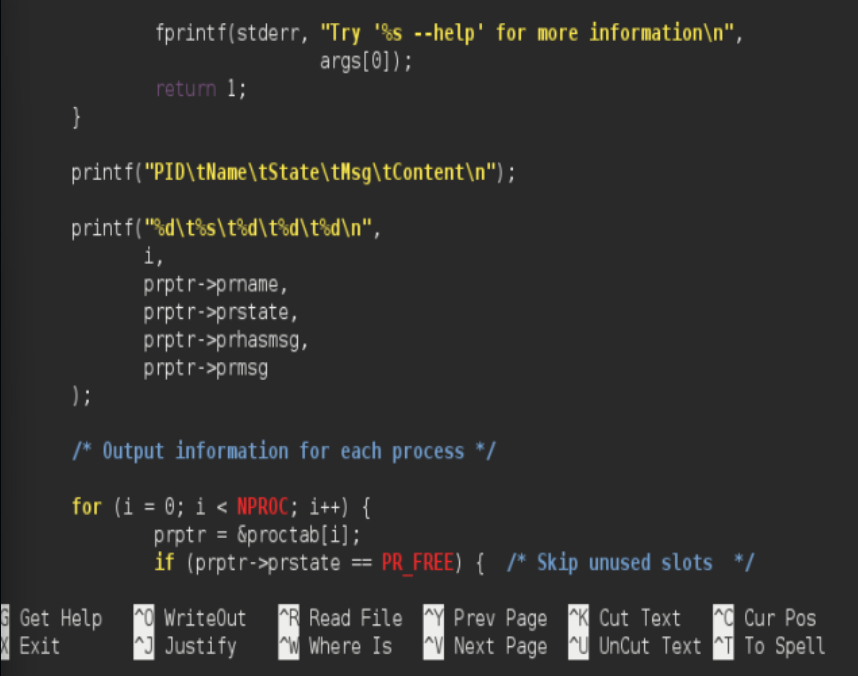
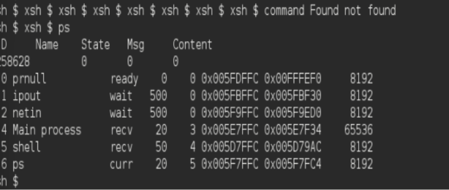
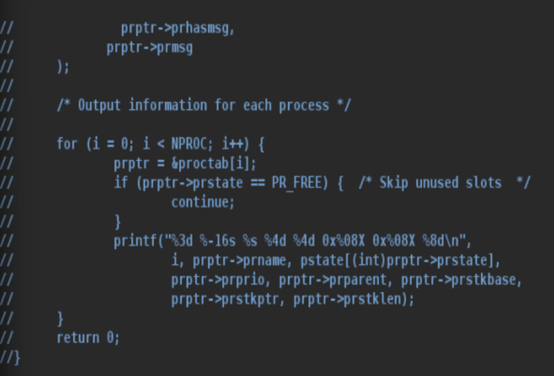
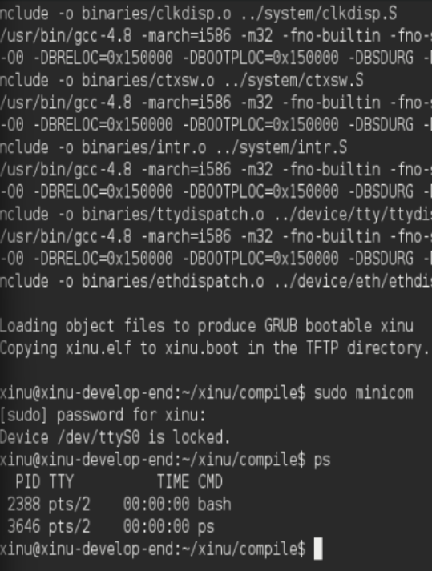

# <h1 align="center">Laporan Praktikum Modul 5  Explorasi Proses </h1>

Prajna Paramitha Wardhany - 2311104016

## Dasar Teori
XINU
XINU ("X is Not Unix") adalah kernel sistem operasi komputer yang dikembangkan di Apple Inc. sejak Desember 1996 untuk digunakan dalam sistem operasi Mac OS X (sekarang macOS) dan dirilis sebagai perangkat lunak bebas dan sumber terbuka sebagai bagian dari OS Darwin

## Unguided
1. 
- a. Berapa banyaknya maksimum proses yang ada pada Xinu? JAWABAN : 50 PROSES
- b. Berapa maksimal panjang nama suatu proses pada Xinu? JAWABAN : MAKSIMAL 16 KARAKTER
- c. Berapa nilai prioritas awal pada saat proses dibuat? JAWABAN : NILAI PRIORITAS TERGANTUNG INPUT WAKTU CREATE(), TAPI DEFAULTNYA 20
- d. Ada berapa total state pada Xinu? Sebutkan!JAWABAN :  6 state PR_FREE → slot kosong, PR_CURR → sedang berjalan,PR_READY → siap dijalankan,PR_RECV → menunggu pesan,PR_SLEEP → sedang tidur (delay),PR_SUSP → suspend (dihentikan sementara).

2. Perintah ps adalah perintah untuk menampilkan statistik process yang berjalan. Source code dari ps tersimpan pada file xsh_ps.c. Carilah file tersebut dan beri komentar pada 20 baris terakhir di source code tersebut!

3. Ubahlah perintah ps (source code: xsh_ps.c) pada Xinu sehingga menampilkan informasi tambahan berupa kolom yang berisi total message yang ada pada proses seperti gambar di bawah ini:

<!--  -->

4. Ubahlah perintah uptime pada Xinu sehingga menampilkan lamanya Xinu sejak booting hanya dalam satuan menit. Langkah pengerjaan:
- Modifikasi source code pada file xsh_uptime.c
- Kompilasi ulang Xinu dengan perintah seperti pada modul sebelumnya
- Jalankan Backend VM
- Setelah sistem berjalan, jalankan perintah $uptime. Pastikan hasilnya sesuai dengan contoh output yang diinginkan
- Screenshot source kode dan output akhir hasil modifikasi

## Referensi

1. https://share.google/di5IoOeGs83Fkxl0c (oracle vm virtual box)
2. https://id.wikipedia.org/wiki/XNU (xinu)