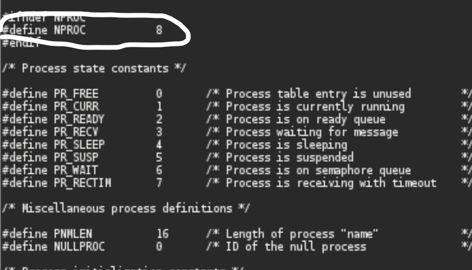
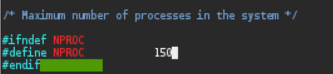
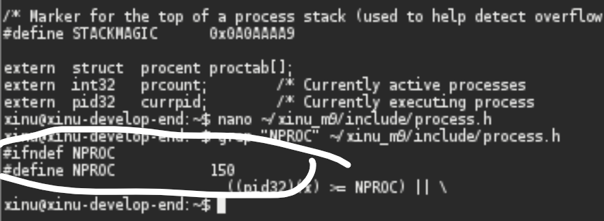
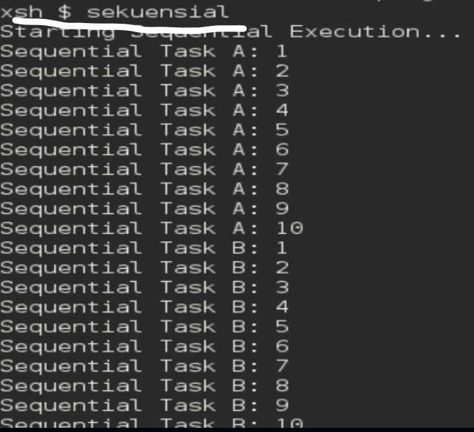
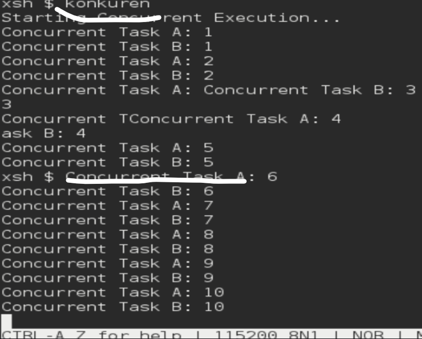

# <h1 align="center">Laporan Praktikum Modul 6  Sekuensial dan konkuren </h1>

Prajna Paramitha Wardhany - 2311104016

## Dasar Teori
Dalam Sistem Operasi, terdapat dua konsep utama dalam eksekusi program, yaitu sekuensial dan konkuren. 
- Program sekuensial dijalankan secara berurutan, di mana setiap instruksi dieksekusi satu per satu sesuai alur kode. 
- konkuren memungkinkan beberapa proses berjalan secara bersamaan melalui mekanisme yang diatur oleh sistem operasi. Pada sistem dengan satu CPU, konkurensi dicapai menggunakan teknik time slicing dalam Multitasking, sehingga CPU berpindah dengan cepat antar proses dan menciptakan ilusi paralelisme. 

## Unguided
1. Selain hardware (memory), batasan maksimal proses dapat ditentukan dengan secara software. Pada Linux maksimal proses adalah 4194303 proses (64 bit) dan 32767 proses (32 bit) dapat dilihat melalui perintah $cat /proc/sys/kernel/pid_max. Carilah pada source code Xinu yang memberi batasan mengenai banyaknya proses yang bisa dibuat! Berapa maksimal proses dalam Xinu? Ubah menjadi maksimal 150 proses! 
JAWABAN : 
CEK RESOURCE DARI CODE XINU YG NGASIH INFO BATASAN PROSES (ADA PADA SS, BERADA DI FILE PROCESS.H YG ADA DI XINU_M9), UNTUK MAKSIMAL PROSES -> ADA 8

JAWABAN : 
UBAH KE 150

2. Jalankan kode sekuensial! 
JAWABAN : 

3. Jalankan kode konkuren! 
JAWABAN : 

4. Buatlah 2 proses produser dan konsumer. Produser memproduksi angka integer dari 1-1000. Konsumer mengkonsumsi integer yang diproduksi oleh produser dan menampilkannya! (Gunakan variabel global bertipe int32 bernama n yang digunakan secara bersama oleh kedua proses)
JAWABAN : 
hasil program seperti itu karena kondisi "race condition" -> yaitu kondisi ketika dua proses mengakses dan memodifikasi data yang sama secara bersamaan tanpa pengaturan sinkronisasi. Pada program tersebut, variabel n dideklarasikan sebagai variabel global yang digunakan oleh dua proses, yaitu produser yang melakukan increment (n++) dan konsumer yang membaca serta mencetak nilai n. Ketika kedua proses dijalankan secara konkuren, eksekusi keduanya bisa saling tumpang tindih sehingga urutan operasi tidak lagi terjamin. 

## Referensi

1. https://share.google/di5IoOeGs83Fkxl0c (oracle vm virtual box)
2. https://id.wikipedia.org/wiki/XNU (xinu)