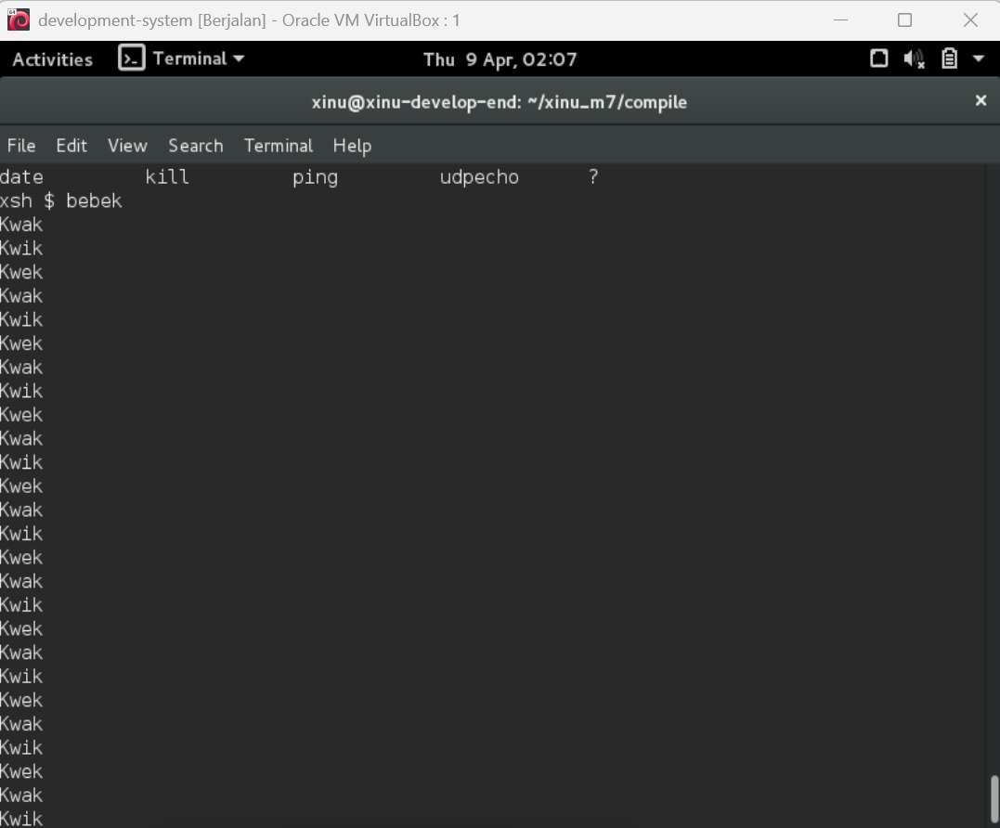
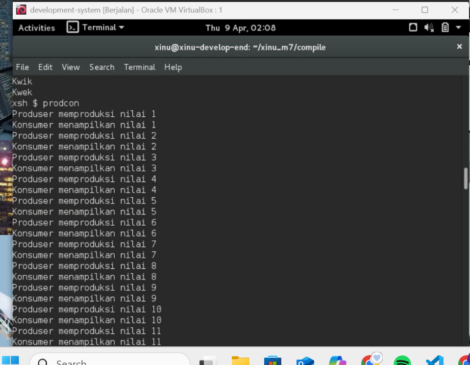

# <h1 align="center">Laporan Praktikum Modul 4  Membaca Source Code Xinu </h1>

Prajna Paramitha Wardhany - 2311104016

## Dasar Teori
XINU
XINU ("X is Not Unix") adalah kernel sistem operasi komputer yang dikembangkan di Apple Inc. sejak Desember 1996 untuk digunakan dalam sistem operasi Mac OS X (sekarang macOS) dan dirilis sebagai perangkat lunak bebas dan sumber terbuka sebagai bagian dari OS Darwin

## Unguided
Jurnal

1. [50 poin] Buatlah 3 buah proses yaitu P1, P2 dan P3. P1 selalu menampilkan “kwak”, P2 selalu menampilkan “kwik”, P3 selalu menampilkan “kwek”. Menggunakan 3 proses tersebut dan beberapa buah semaphore, buatlah program yang dapat menampilkan: 
Kwak
Kwik
Kwek
Kwak
Kwik
Kwek

2. [50 poin] Buatlah proses bernama produser yang memproduksi bilangan 1-1000. Buatlah proses bernama konsumer yang akan menampilkan nilai yang diproduksi oleh produser. Gunakan semaphore! 
Produser memproduksi nilai 1
Konsumer menampilkan nilai 1
Produser memproduksi nilai 2
Konsumer menampilkan nilai 2
….
Produser memproduksi nilai 1000
Konsumer menampilkan nilai 1000

Catatan: harus menggunakan semaphore, proses konkuren, tidak boleh hanya 1 proses dan hanya menggunakan while loop kemudian print.

## Referensi

1. https://share.google/di5IoOeGs83Fkxl0c (oracle vm virtual box)
2. https://id.wikipedia.org/wiki/XNU (xinu)