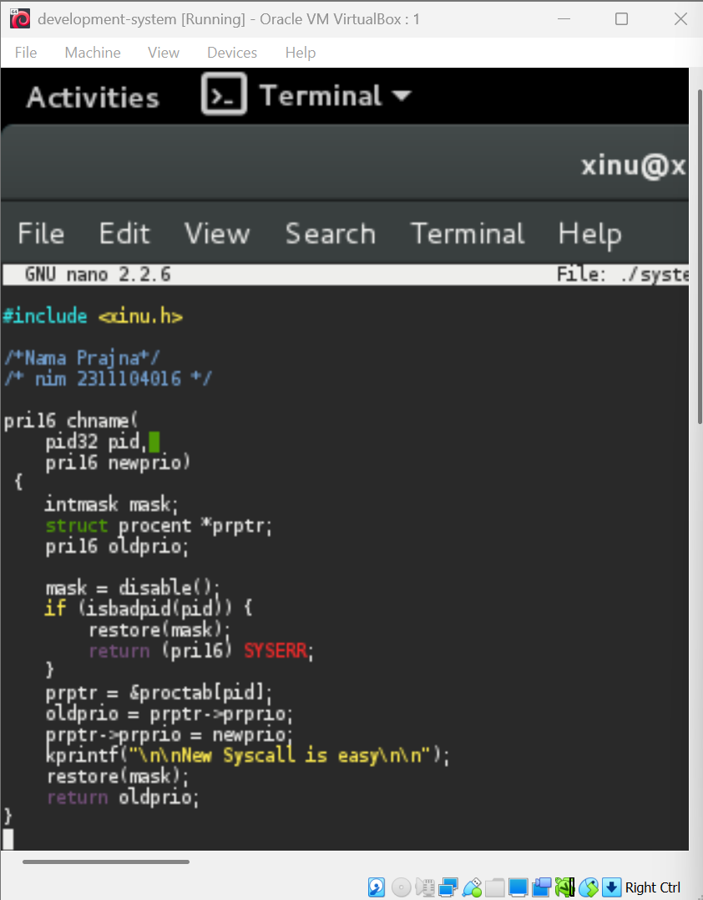
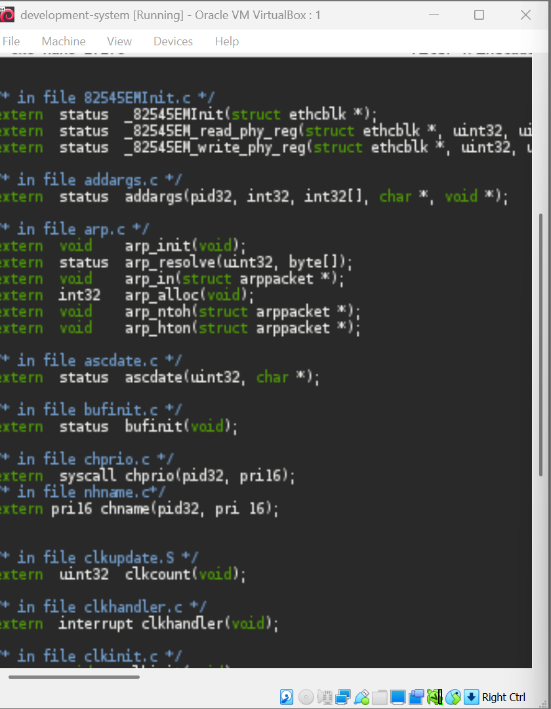
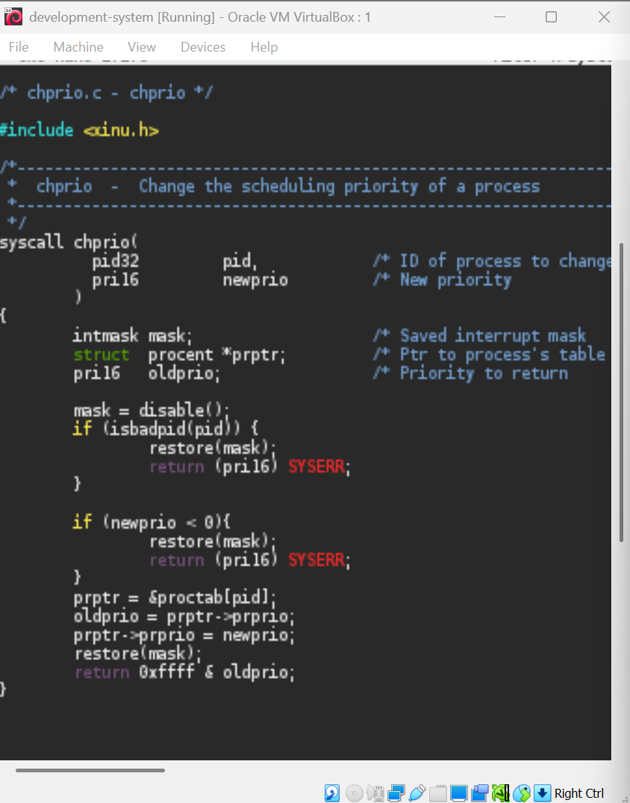
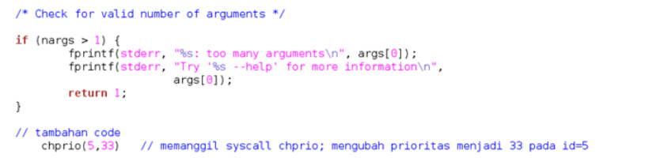
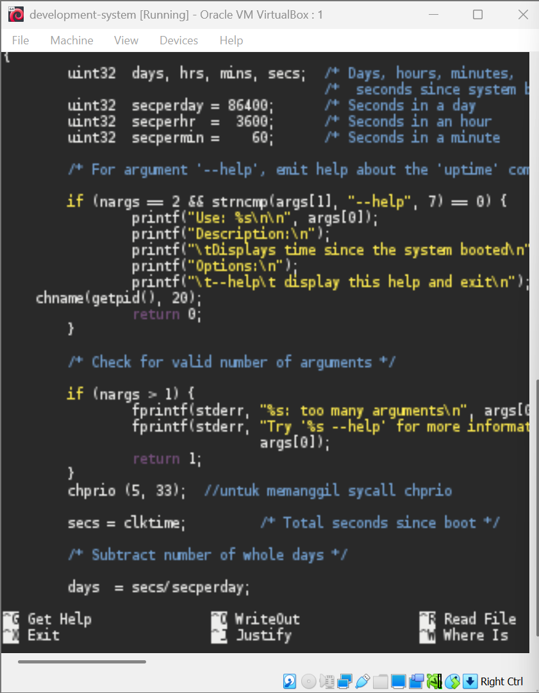
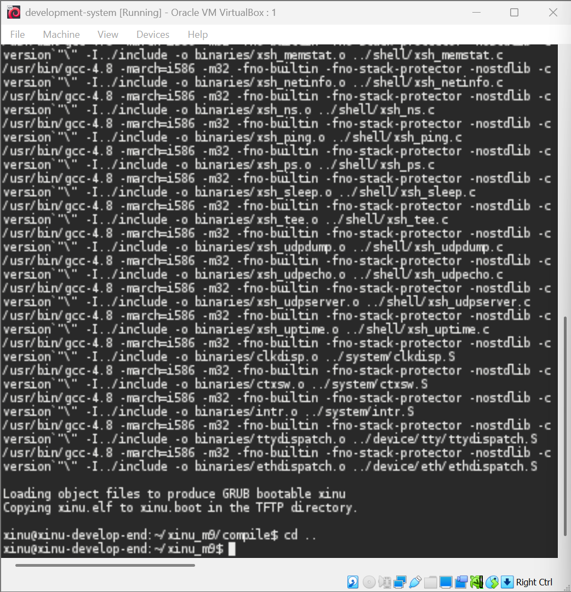
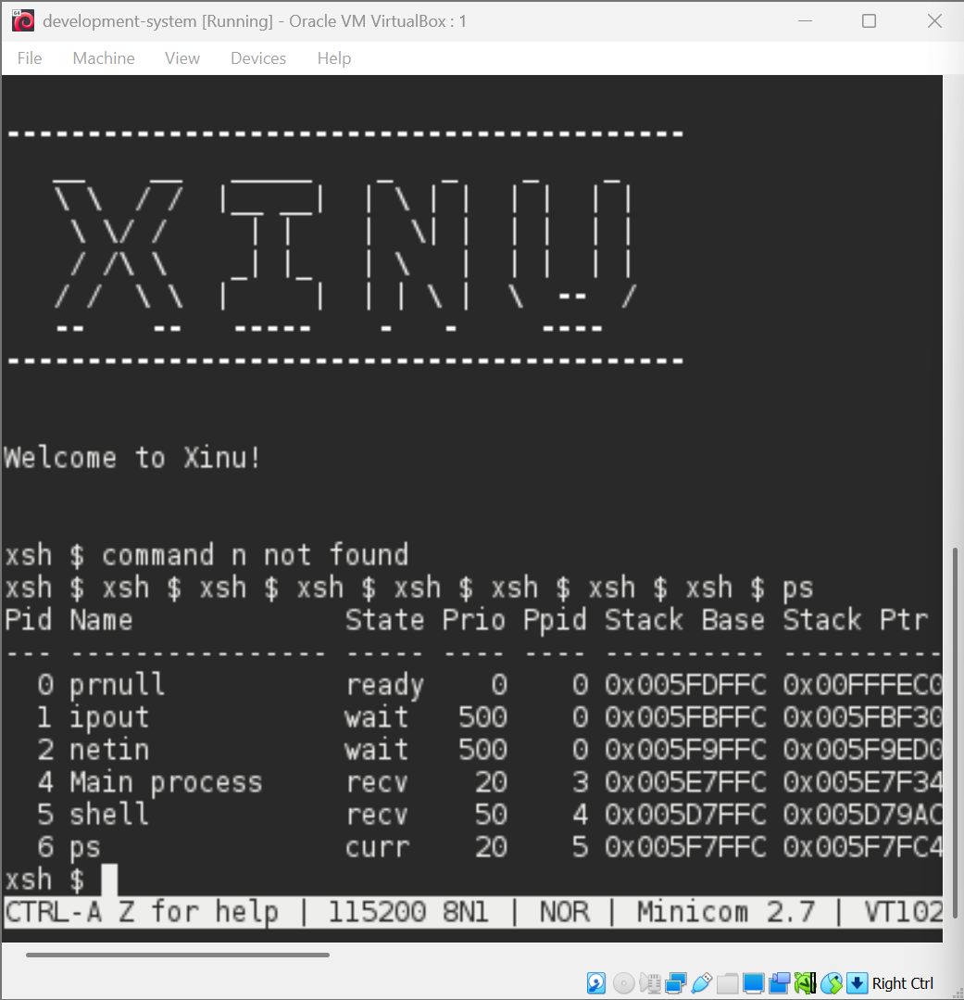
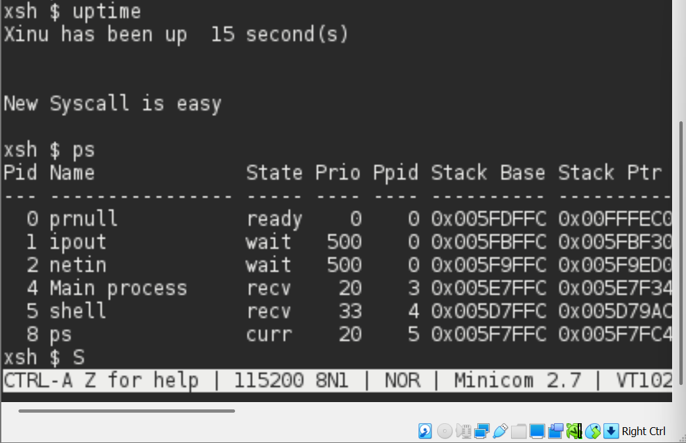
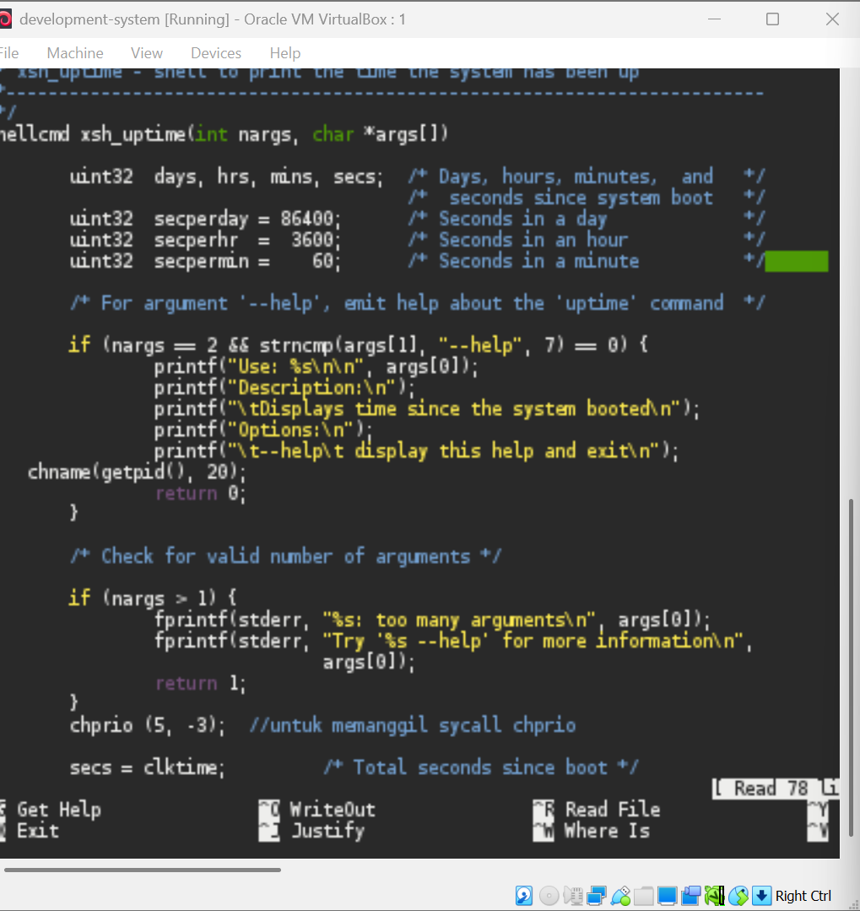
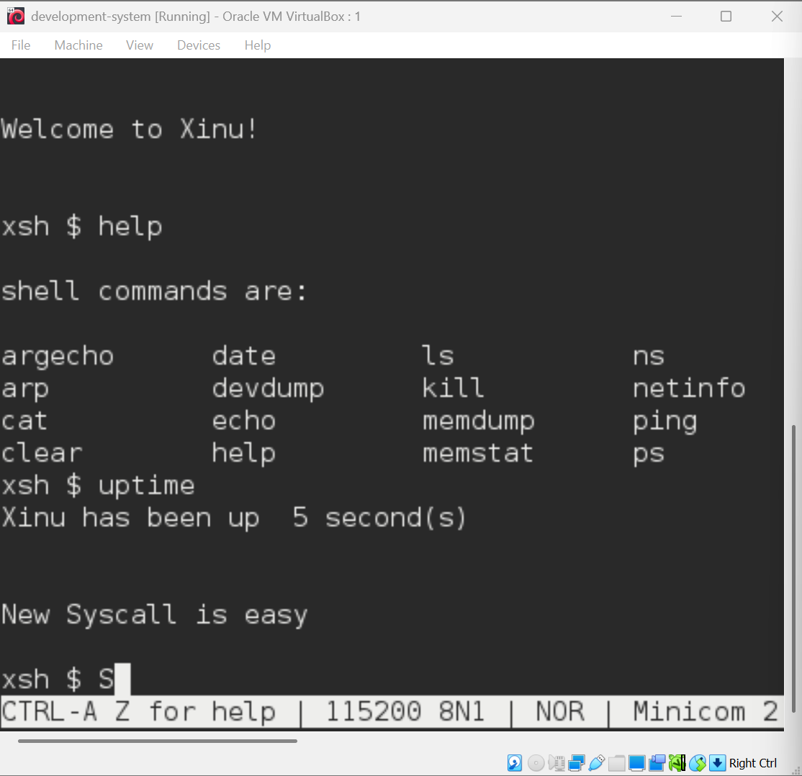

# <h1 align="center">Laporan Praktikum Modul 9  Update sysccall</h1>

Prajna Paramitha Wardhany - 2311104016

## Dasar Teori
XINU
XINU ("X is Not Unix") adalah kernel sistem operasi komputer yang dikembangkan di Apple Inc. sejak Desember 1996 untuk digunakan dalam sistem operasi Mac OS X (sekarang macOS) dan dirilis sebagai perangkat lunak bebas dan sumber terbuka sebagai bagian dari OS Darwin

## Unguided
Jurnal

1. [50 Poin] Buat syscall baru seperti yang ditunjukkan pada modul syscall poin 9.5! (sertakan Screenshot kode dan hasil run)

2. [25 Poin] Perbaiki syscall chprio (xinu/system/chprio.c) dengan memperhatikan validasi input 
- Pastikan id adalah angka dari 0 – NPROC (ukuran maks banyaknya proses)
- Pastikan prioritas adalah bilangan yang positif
- Compile dan jalankan Xinu dengan syscall yang telah diperbaiki
make clean
make

Lakukan hal-hal berikut ini
Edit xsh_uptime.c
Tambahkan kode berikut

kodingan yg sudah diupdate

- Compile source code tersebut dengan perintah make clean,make

- Jalankan perintah ps xsh $ ps

- perhatikan prioritas proses dengan id = 5 
- Jalankan uptime xsh $ uptime
- Perhatikan hasil perintah tersebut
- Jalankan ps xsh $ ps
- perhatikan prioritas proses dengan id = 5 seharusnya sudah berubah

3. [25 Poin] Testing chprio syscall yang telah diubah
Testing prioritas tidak boleh < 0: Ubah “chprio(5,33)” menjadi “chprio(5,-3)” pada xsh_uptime.c
Testing id adalah valid: Ubah “chprio(5,33)” menjadi “chprio(3000,3)”
Hasil dua testing di atas adalah prioritas tidak berubah karena salah argument (dibuktikan dengan menggunakan perintah ps)
1. coba ganti xsh_uptime chprionya menjadi (5, -3) 

## Referensi

1. https://share.google/di5IoOeGs83Fkxl0c (oracle vm virtual box)
2. https://id.wikipedia.org/wiki/XNU (xinu)

