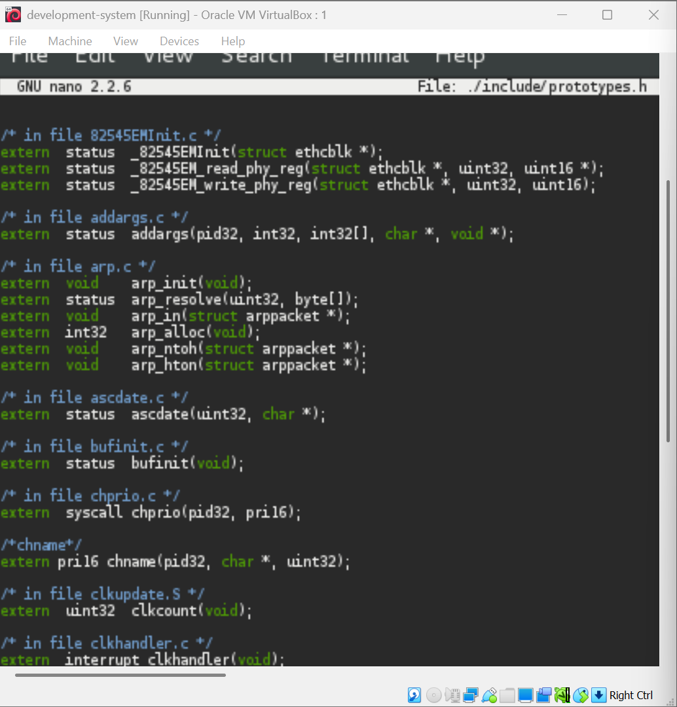
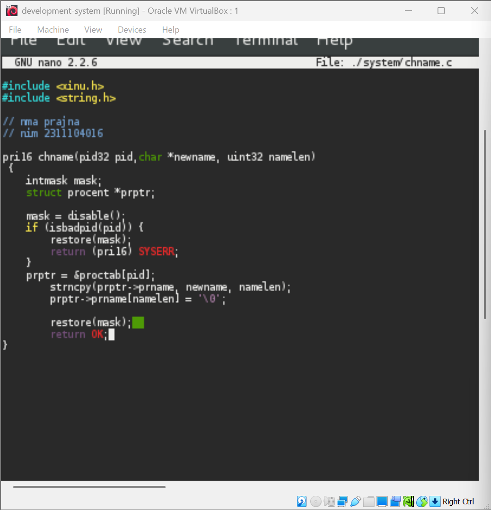
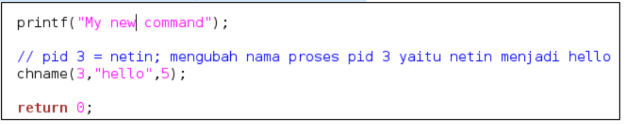
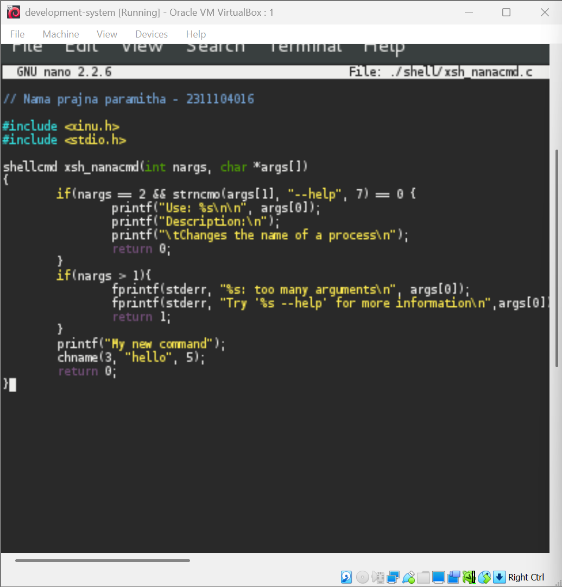
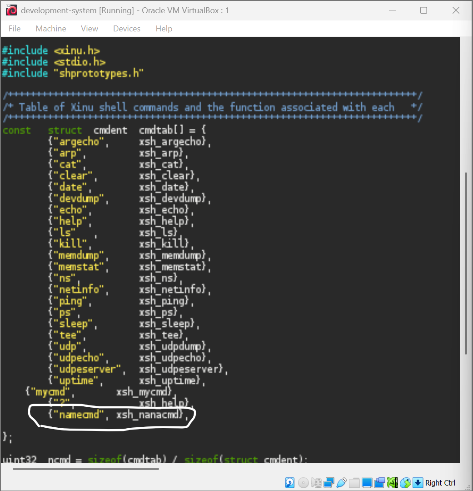
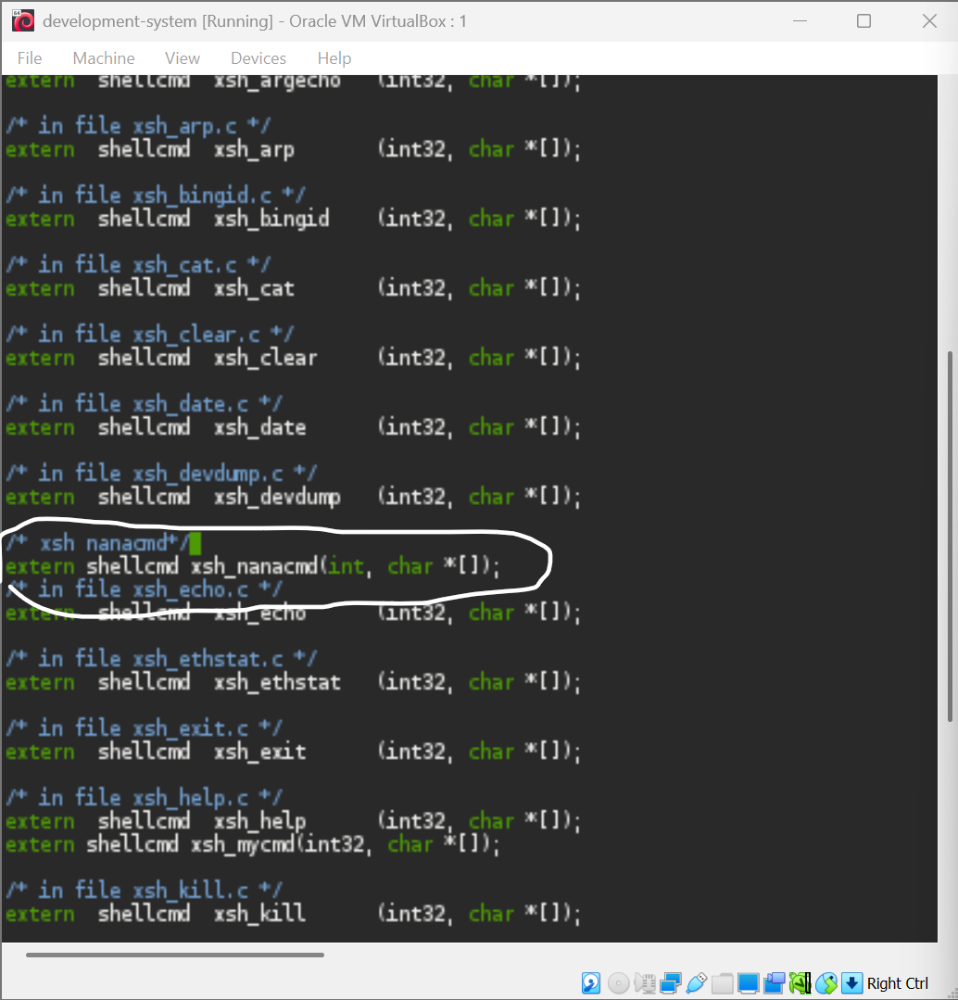
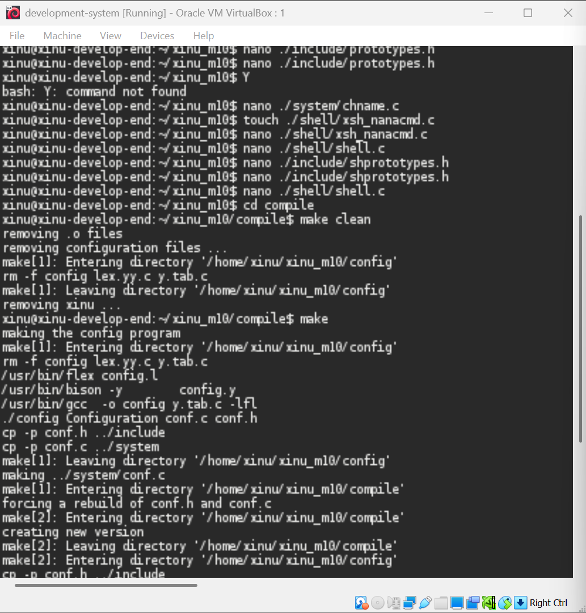

# <h1 align="center">Laporan Praktikum Modul 10  Update syscall</h1>

Prajna Paramitha Wardhany - 2311104016

## Dasar Teori
XINU
XINU ("X is Not Unix") adalah kernel sistem operasi komputer yang dikembangkan di Apple Inc. sejak Desember 1996 untuk digunakan dalam sistem operasi Mac OS X (sekarang macOS) dan dirilis sebagai perangkat lunak bebas dan sumber terbuka sebagai bagian dari OS Darwin

## Unguided
Jurnal
1. [40 Poin] Akan dimodifikasi shell dengan modifikasi syscall bernama chname yang
berfungsi untuk mengubah nama suatu proses. Lihat kembali modul sebelumnya cara
membuat syscall.
Perhatikan sekarang syscall chname mempunyai 3 parameter yaitu pid, character dan
panjang character. Character untuk menyimpan nama dan panjang character untuk
panjang nama.
a. Pada prototypes.h chname diubah menjadi:
jawaban : 

b. Pada chname.c fungsi diubah dari:
jawaban : 

2. Buatlah perintah baru bernama namecmd sesuai dengan langkah-langkah pada no.5 pada modul shell!Berikut adalah kode dalam perintah baru namecmd:

jawaban : 

daftarkan di shell

daftarkan di prototypes.h

3. compile & test
running compile, make clean, make

## Referensi

1. https://share.google/di5IoOeGs83Fkxl0c (oracle vm virtual box)
2. https://id.wikipedia.org/wiki/XNU (xinu)

