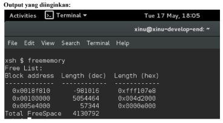
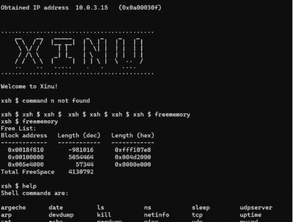
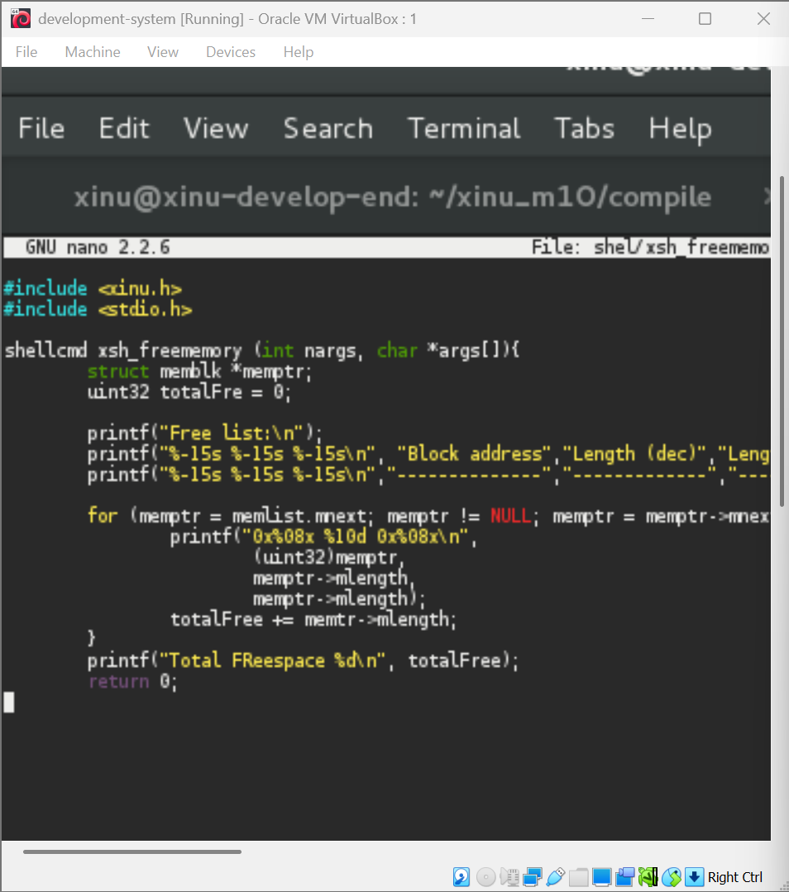

# <h1 align="center">Laporan Praktikum Modul 11  Memori Xinu</h1>

Prajna Paramitha Wardhany - 2311104016

## Dasar Teori
XINU
XINU ("X is Not Unix") adalah kernel sistem operasi komputer yang dikembangkan di Apple Inc. sejak Desember 1996 untuk digunakan dalam sistem operasi Mac OS X (sekarang macOS) dan dirilis sebagai perangkat lunak bebas dan sumber terbuka sebagai bagian dari OS Darwin

## Guided
Summary youtube : 
Memahami manajemen memori sangat penting bagi programmer karena membantu memahami bagaimana program berjalan dan bagaimana kinerjanya dapat dioptimalkan. Dalam bahasa C, memori program dibagi menjadi beberapa segmen, yang masing-masing digunakan untuk menyimpan jenis data yang berbeda.

1. Segmen Text (Code)
Menyimpan instruksi atau kode program yang dapat dieksekusi.
Umumnya bersifat read-only (hanya bisa dibaca) dan ukurannya tetap selama program berjalan.
2. Segmen Data Terinisialisasi (Initialized Data Segment)
Menyimpan variabel global dan static yang telah diberi nilai awal.
Data dimuat langsung dari file executable.
Data dalam segmen ini dapat dibaca dan diubah (read/write).
3. Segmen BSS (Uninitialized Data Segment)
Menyimpan variabel global dan static yang belum diberi nilai awal.
Secara otomatis diinisialisasi menjadi 0 saat program dijalankan.
Memungkinkan penghematan ukuran file executable karena hanya ukuran data yang disimpan, bukan seluruh nilai nolnya.
4. Heap
Digunakan untuk alokasi memori secara dinamis.
Ukurannya dapat bertambah atau berkurang selama program berjalan.
Dikelola secara manual oleh programmer menggunakan fungsi seperti malloc() dan free() pada C (atau new dan delete pada C++).
Cocok untuk struktur data dinamis seperti linked list.
Jika tidak dikelola dengan baik, dapat menyebabkan memory leak dan kesalahan memori lainnya.
5. Stack
Menyimpan pemanggilan fungsi, variabel lokal, dan parameter fungsi.
Menggunakan prinsip LIFO (Last In, First Out), yaitu data yang terakhir masuk akan menjadi yang pertama keluar.
Saat fungsi dipanggil, data terkait fungsi tersebut ditambahkan ke stack. Ketika fungsi selesai, data tersebut dihapus dari stack.
Pengelolaannya dilakukan secara otomatis oleh sistem.
Kesimpulan

Memori pada program C dibagi menjadi lima segmen utama: Text, Initialized Data, BSS, Heap, dan Stack. Memahami fungsi masing-masing segmen membantu programmer menulis program yang lebih efisien, mengelola memori dengan benar, serta menghindari masalah seperti memory leak dan kesalahan yang berkaitan dengan penggunaan memori.

## Unguided
1. Buatlah perintah baru bernama freememory yang memiliki dua fungsi berikut:
a.Menampilkan seluruh free memory block yang tercatat dalam free memory list pada Xinu.
b.Menghitung dan menampilkan total ukuran free memory berdasarkan seluruh block yang ada pada list tersebut.

Isi file dari freememory :  

2. Jawablah pertanyaan berikut:
a. Mengapa Xinu memisahkan data segment dan BSS segment? 
*jawaban :*
Data segment menyimpan variabel global/static yang sudah diinisialisasi dengan nilai tertentu (contoh: int x = 5), sehingga nilainya harus disimpan di dalam file binary.
BSS segment menyimpan variabel global/static yang belum diinisialisasi atau diinisialisasi ke nol (contoh: int y;). Karena semua isinya nol, BSS tidak perlu menyimpan data aktual di binary — cukup dicatat ukurannya, lalu di-zero-fill saat loading.
Alasan pemisahan: Menghemat ukuran file binary (BSS tidak butuh ruang di disk)
Efisiensi loading

b. Bagaimana alokasi dan dealokasi memori selama eksekusi memengaruhi ukuran free
space?  
*jawaban:*
- Setiap kali getmem() dipanggil → free space berkurang (block diambil dari free list)
- Setiap kali freemem() dipanggil → free space bertambah (block dikembalikan ke free list)
- Xinu menggunakan first-fit allocation: mencari block pertama yang cukup besar
- Jika dealokasi dilakukan, Xinu akan menggabungkan (coalesce) block yang berdekatan agar tidak terjadi fragmentasi berlebihan

c. Mengapa penggunaan heap lebih berpotensi menimbulkan masalah dibandingkan
stack? 
*jawaban:*
Karena heap :
- manajemen : manual programmer
- lifetime : bebas, bsoa bocor
- fragmentasi : bisa terjasi
- error umum : memory leak, danging pointer

d. Mengapa Xinu menggunakan struktur linked list untuk menyimpan free block? 
*jawaban:*
- Free memory block tersebar tidak berurutan di memori fisik → linked list cocok untuk struktur non-kontigu
- Mudah digabung (coalesce): saat dealokasi, tinggal cek node tetangga di list
- Fleksibel: ukuran tiap block bisa berbeda-beda
- Overhead kecil: metadata (pointer next + size) disimpan di dalam block itu sendiri (struct memblk)

e. Apa tantangan utama dalam penggunaan heap di Xinu? 
*jawaban*

- Fragmentasi eksternal: banyak block kecil tersebar sehingga request block besar gagal meski total free space cukup
- Tidak ada garbage collector: programmer harus freemem() secara manual
- Korupsi heap: bug seperti buffer overflow bisa merusak metadata linked list
- Konkurensi: di sistem multitasking, akses heap dari beberapa proses sekaligus harus dilindungi dengan mekanisme sinkronisasi (Xinu menonaktifkan interrupt saat operasi memori)
- Performa: pencarian first-fit pada free list yang panjang bisa lambat (O(n))
## Referensi

1. https://share.google/di5IoOeGs83Fkxl0c (oracle vm virtual box)
2. https://id.wikipedia.org/wiki/XNU (xinu)
