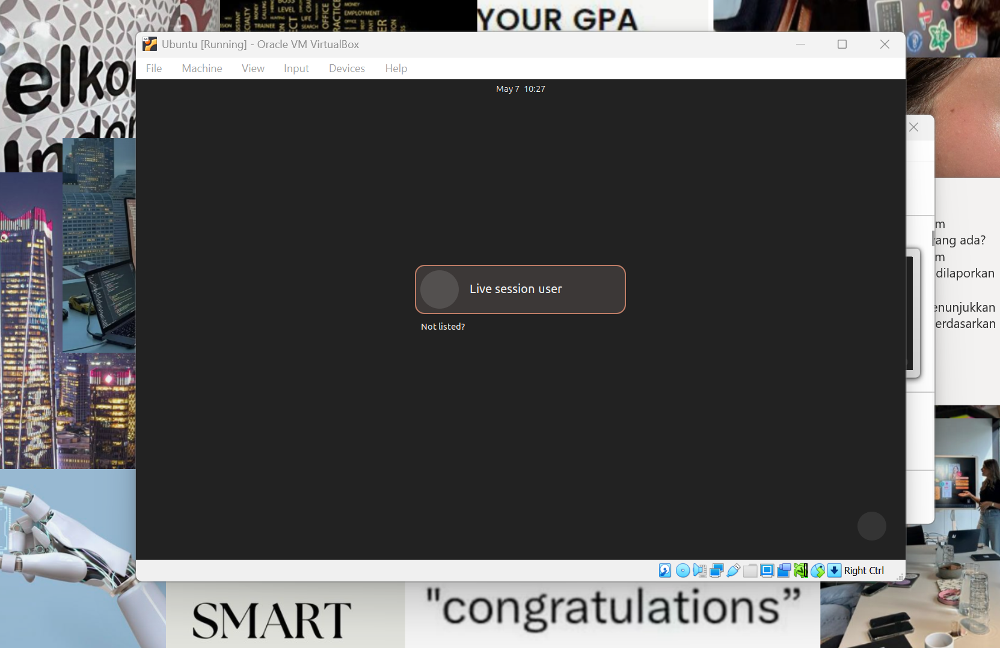
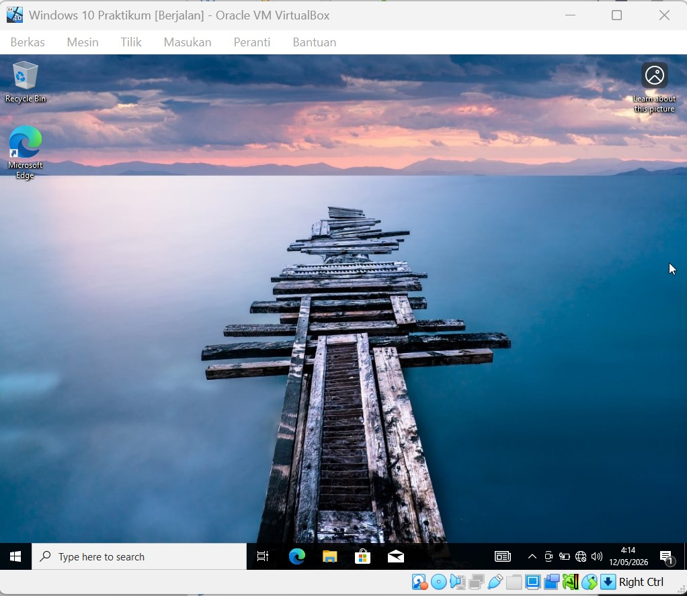

# <h1 align="center">Laporan Praktikum Modul 10  Install linux & windows</h1>

Prajna Paramitha Wardhany - 2311104016

## Dasar Teori
XINU
XINU ("X is Not Unix") adalah kernel sistem operasi komputer yang dikembangkan di Apple Inc. sejak Desember 1996 untuk digunakan dalam sistem operasi Mac OS X (sekarang macOS) dan dirilis sebagai perangkat lunak bebas dan sumber terbuka sebagai bagian dari OS Darwin

## Unguided
Instalasi Ubuntu

Instalasi windows 10

1. [10 Poin] Jelaskan dengan bahasa sendiri, apa itu Sistem Operasi?
 
*jawaban*
Sistem Operasi (OS) adalah perangkat lunak utama yang menjadi jembatan antara pengguna dan hardware komputer. OS bertugas mengelola semua sumber daya komputer seperti memori, prosesor, penyimpanan, dan perangkat input/output, sehingga program-program lain bisa berjalan dengan baik. Tanpa sistem operasi, pengguna harus berinteraksi langsung dengan hardware yang sangat rumit. Contoh sederhananya, ketika kita membuka aplikasi, OS-lah yang mengatur alokasi memori dan jadwal eksekusi prosesnya.

2. [25 Poin] Buka dxdiag pada kolom search windows, dan jawab pertanyaan berikut!
    [5 Poin] Sertakan Screenshot!
    - [5 Poin] Windows apakah yang diinstal? *jawaban* Windows 10
    -  [5 Poin] Berapa bit Windows yang diinstall?*jawaban* 64 bit
    -  [5 Poin] Berapa kecepatan processor yang digunakan?*jawaban* 2.40 GHz 
    -  [5 Poin] Grafik yang digunakan versi berapa? Apakah sudah sesuai dengan     spesifikasi rekomendasi pada modul?*jawaban* DirectX 12

3. [10 Poin] Apa kelebihan dari windows yang terpasang sekarang? Sebutkan versi berapa  windows terbaru saat ini! 
*jawaban*
Windows versi 10 
- Antarmuka yang mudah digunakan dan familiar bagi kebanyakan orang
- Kompatibilitas software sangat luas, hampir semua aplikasi tersedia untuk Windows
- Dukungan hardware yang sangat baik, driver mudah ditemukan
- Memiliki ekosistem gaming terbesar
- Update keamanan rutin dari Microsoft
- Mendukung banyak format file dan perangkat peripheral

4. [25 Poin] Buka virtualbox, dan jawab pertanyaan berikut!
    [5 Poin] Sertakan Screenshot!
    - [5 Poin] Linux apakah yang diinstall?  Ubuntu 26.04 LTS 
    - [5 Poin] Berapa bit Linux yang diinstall?  Bit Linux: 64-bit (Intel or AMD 64-bit architecture)
    - [5 Poin] Berapa ukuran hard disk virtual mesin?  6gb
    - [5 Poin] Terdapat berapa buah partisi pada hard disk? 

5. [10 Poin] Linux memiliki berbagai jenis, sebutkan 5 jenis linux distro! 
*jawaban*
- Ubuntu
- Debian
- Fedora
- Arch 
- Linux

6. [10 Poin] Anda sudah mengenal dan menggunakan 3 jenis sistem operasi pada praktikum ini, sebutkan sistem operasi tersebut! 
*jawaban*
- Windows 10 :  sistem operasi utama di komputer host
- Ubuntu 26.04 LTS : dijalankan melalui VirtualBox sebagai development system
- Xinu OS : sistem operasi embedded buat praktikum

7. [10 Poin] Setelah mengenal 3 jenis sistem operasi tersebut, menurut Anda sistem
operasi mana yang lebih mudah digunakan? Jelaskan argumentasi Anda! 
*jawaban*
Menurut saya, Windows 10 adalah sistem operasi yang paling mudah digunakan, dengan alasan:
- Antarmuka grafis (GUI) yang mudah dipahami
- Hampir semua orang sudah familiar
- Instalasi software mudah, tinggal download dan klik install
- Troubleshooting lebih mudah karena dokumentasi dan komunitas sangat besar
- Lebih ringan dibanding Windows 11 sehingga cocok untuk berbagai spesifikasi hardware

## Referensi

1. https://share.google/di5IoOeGs83Fkxl0c (oracle vm virtual box)
2. https://id.wikipedia.org/wiki/XNU (xinu)
