# <h1 align="center">Laporan Praktikum Modul 13  PERINTAH DASAR LINUX </h1>

Prajna Paramitha Wardhany - 2311104016

## Dasar Teori
XINU
XINU ("X is Not Unix") adalah kernel sistem operasi komputer yang dikembangkan di Apple Inc. sejak Desember 1996 untuk digunakan dalam sistem operasi Mac OS X (sekarang macOS) dan dirilis sebagai perangkat lunak bebas dan sumber terbuka sebagai bagian dari OS Darwin

## Unguided

1. Terminal (4 poin)
Pada terminal Linux terdapat command prompt seperti ini:
Pertanyaan:
 
a. Jalankan dan screenshot terminal Anda!
 
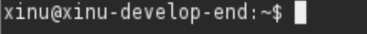
b. Jelaskan arti dari command prompt milik Anda!
 
xinu = username yang sedang login  
xinu-develop-end = nama komputer (hostname)  
~ = direktori saat ini (home directory)  
$ = menunjukkan user biasa (bukan root)  

2. Perintah pertama (7 poin)
Pertanyaan: 
a. Jalankan dan screenshot perintah berikut ini: ls  
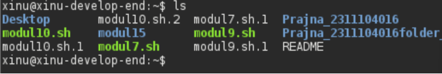
b. Apakah option dan parameter dari perintah di atas? 
    - Option: tidak ada 
    - Prameter: tidak ada 
    - ls dijalankan tanpa option dan parameter 

c. Apa fungsi dari perintah tersebut? 
Perintah ls berfungsi untuk menampilkan daftar file dan folder yang ada di direktori saat ini.

d. Jalankan perintah berikut ini: ls -al / 
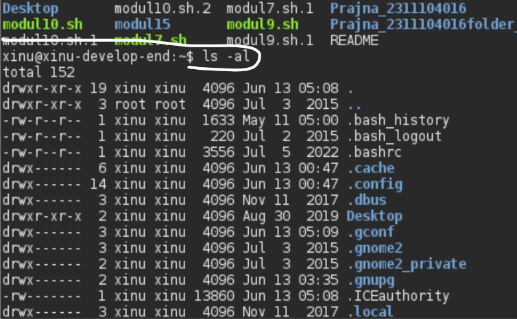

e. Apakah option dan parameter dari perintah di atas? 
- Option: -al (gabungan dari -a dan -l)
- Parameter: / (direktori root)

f. Apa fungsi dari perintah tersebut? 
- -a = menampilkan semua file termasuk file tersembunyi (diawali titik)
- -l = menampilkan dalam format list panjang (ukuran, permission, tanggal)
- / = menampilkan isi direktori root

g. Jelaskan mengapa perintah pada a dan e mempunyai hasil yang berbeda! 
Perintah ls dan ls -al / hasilnya berbeda karena:
- ls → menampilkan file di direktori saat ini, tanpa detail, tanpa file tersembunyi
- ls -al / → menampilkan file di direktori root beserta detail lengkap dan file tersembunyi

3. Pohon file (6 poin)
Melihat struktur direktori dan file pada Linux sama seperti melihat file dan direktori (folder) yang berada pada GUI. Pada Linux terdapat direktori utama yaitu “/” (root). Di bawah direktori root terdapat berbagai direktori yang lain seperti: home, etc, usr, dll. Contoh: program firefox terdapat pada path /usr/lib/firefox, berarti untuk mengakses firefox kita berjalan dari root kemudian direktori “usr” dilanjutkan direktori “lib” baru dapat mengeksekusi firefox
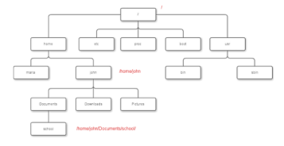

Pertanyaan:
- Jalankan dan screenshot perintah: pwd
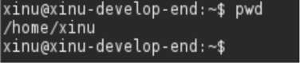
- Apakah option dan parameter dari perintah tersebut?
    - Option : tidak ada
    - Parameter : tidak ada

- Apa fungsi perintah tersebut?
Perintah pwd (Print Working Directory) berfungsi untuk menampilkan lokasi direktori saat ini secara lengkap (full path).

4. Perpindahan (6 poin)
- Jalankan dan screenshot perintah: cd /
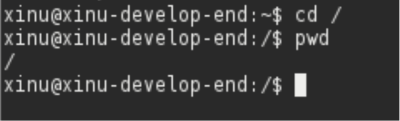
- Apakah option dan parameter dari perintah tersebut?
    - Option: tidak ada
    - Parameter: / (direktori root)
- Apa yang dilakukan perintah tersebut?
Perintah cd / berfungsi untuk berpindah ke direktori root (direktori paling atas dalam struktur pohon file Linux).

5. Direktori khusus (6 poin)
~ disebut direktori home. Misalkan user bernama linus,mempunyai home directory /home/linus, dengan melakukan cd ~ maka sama dengan cd /home/linus. merepresentasikan parent directory. Jika kita berada dalam folder /home dan kemudian mengeksekusi perintah cd .. berarti kita berpindah dari direktori /home ke parentnya yaitu direktori / . merupakan current  directory, pada gambar pohon di atas jika kita berada pada folder /home/john maka untuk mengakses school dapat digunakan perintah ./Documents/school
- Lakukan dan screenshot perintah cd / kemudian lakukan perintah cd ~. jelaskan hasil dari keduanya!
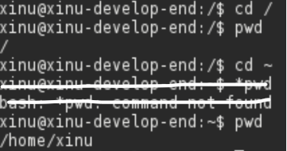
    - cd / → berpindah ke direktori root (/)
    - cd ~ → berpindah ke direktori home user saat ini (/home/xinu)

- Lakukan perintah cd /proc/self. Buatlah perintah menggunakan cd .. agar dapat berpindah ke direktori / (root). Berapa kali perintah cd .. harus dieksekusi? Screenshot hasilnya!
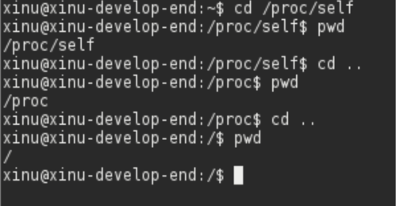
Perintah cd .. harus dieksekusi 2 kali karena:
    - /proc/self → cd .. → /proc
    - /proc → cd .. → /
6. Copy, rename dan delete file (screenshot setiap tahapan!) (14 poin)
Hint: gunakan cp, mv, dan rm
- Copylah file dari /proc/cpuinfo ke folder home Anda (/home/user/) menggunakan command pada terminal. Ganti user dengan username anda.
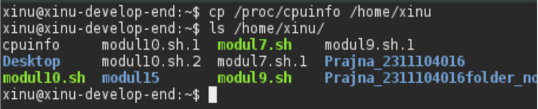
- Tunjukkan menggunakan perintah bahwa file tersebut benar-benar telah dicopy ke folder home Anda.

- Copy file dari /proc/uptime ke folder home Anda.
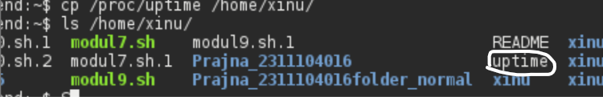
- Tunjukkan menggunakan perintah bahwa file tersebut benar-benar telah dicopy ke folder home Anda.

- Hapuslah file uptime di folder home Anda.
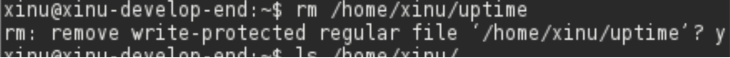
- Tunjukkan menggunakan perintah bahwa file tersebut benar-benar telah dihapus ke folder home Anda.
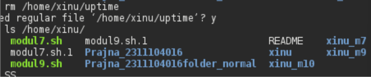
- Rename file cpuinfo di folder home Anda menjadi infocpu
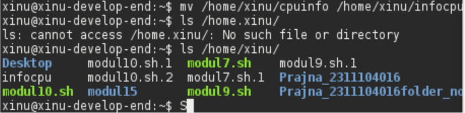
## Referensi

1. https://share.google/di5IoOeGs83Fkxl0c (oracle vm virtual box)
2. https://id.wikipedia.org/wiki/XNU (xinu)
