# <h1 align="center">Laporan Praktikum Modul 15  KEAMANAN </h1>

Prajna Paramitha Wardhany - 2311104016

## Dasar Teori
XINU
XINU ("X is Not Unix") adalah kernel sistem operasi komputer yang dikembangkan di Apple Inc. sejak Desember 1996 untuk digunakan dalam sistem operasi Mac OS X (sekarang macOS) dan dirilis sebagai perangkat lunak bebas dan sumber terbuka sebagai bagian dari OS Darwin

## Unguided
Pembuatan folder nama_nim
 
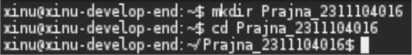
1. Integritas: dasar hashing [10 Point]
    - [2 Point] Lakukan hash SHA256, SHA512 dan MD5 untuk file /etc/passwd. Berapa nilai hash dari file /etc/passwd? Screenshot nilai hash dari file tersebut.
     
    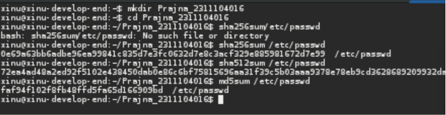

    - [2 Point] Buatlah file bernama test_0.txt pada folder /home/praktikan. Isi file tersebut isi yang ada di file /etc/passwd (copy paste isi file /etc/passwd ke test_0.txt)
     
    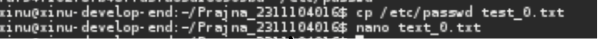
    
    - [2 Point] Lakukan hash SHA256, SHA512 dan MD5 untuk file test_0.txt. Berapa nilai hash dari file test_0.txt? Screenshot nilai hash dari file test_0.txt.
     
    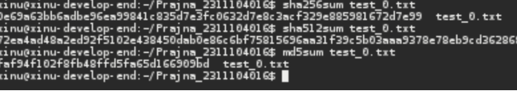

    - [2 Point] Rename file test_0.txt menjadi file_0.txt. Lakukan hash SHA256, SHA512 dan MD5 untuk file_0.txt. Berapa nilai hash file_0.txt? Screenshot nilai hash dari file_0.txt.
     
    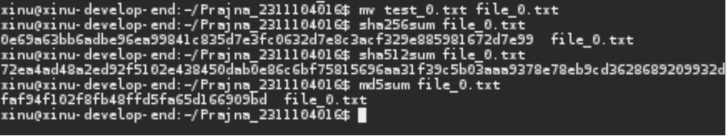

    - [2 Point] Apa hasil pengamatan Anda? File apa saja yang mempunyai hash yang sama? Jelaskan!
     
    Ketiga file (/etc/passwd, test_0.txt, file_0.txt) memiliki nilai hash yang sama karena: 
    1. test_0.txt dibuat dengan meng-copy isi /etc/passwd → isinya identik
    2. file_0.txt hanya berganti nama dari test_0.txt → isinya tidak berubah
    3. Hash ditentukan oleh isi file, bukan nama file. Selama isinya sama, nilai hash selalu sama

2. Integritas: avalance [15 Point]
    - [3 Point] Download file bernama test_1.txt di link ini tiny.cc/test1_txt
     
    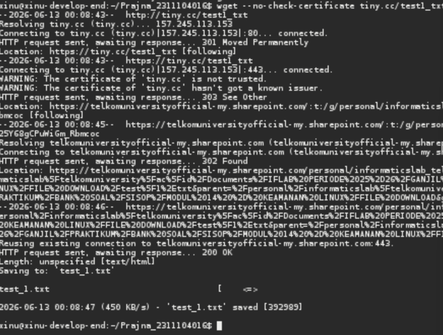
    - [3 Point] Lakukan hash SHA256, SHA512 dan MD5 untuk file test_1.xt. Berapa nilai hash test_1.txt? Screenshot nilai hash dari file test_1.txt.
     
    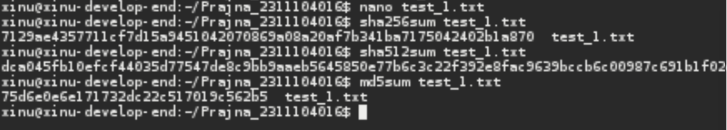
    - [3 Point] Hapuslah titik diakhir file test_1.txt tersebut, simpan file tersebut!
     
    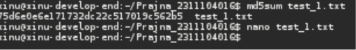
    - [3 Point] Lakukan hash dari SHA256, SHA512 dan MD5. Screenshot nilai hash dari filetest_1.txt.
     
    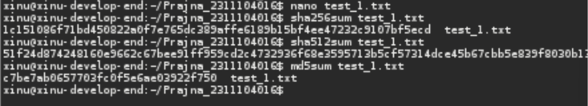
    - [3 Point] Apa analisis (hasil pengamatan) Anda mengenai haltersebut! Apakah nilai hash sama?
     
    Nilai hash berbeda sama sekali meskipun hanya menghapus 1 karakter (titik). Inilah yang disebut avalanche effect perubahan sekecil apapun pada isi file akan menghasilkan nilai hash yang sangat berbeda. Hal ini membuktikan bahwa hashing sangat sensitif terhadap perubahan data, sehingga cocok untuk mendeteksi modifikasi file.

3. Integritas: metadata [18 Point]
    - [3 Point] Download file bernama test_1.doc di link ini tiny.cc/ test1_doc
         
    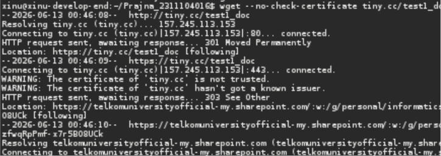

    - [3 Point] Lakukan hash SHA256, SHA512 dan MD5 untuk file test_1.doc. Screenshot nilai hash dari file test_1.doc.
     
    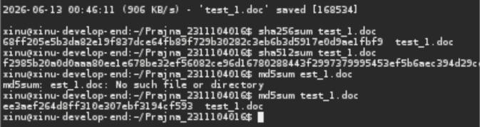

    - Buka kembali file test_1.doc. Lakukan hal ini:
        1. [3 Point] Ketik abcdef. Save test_1.doc
        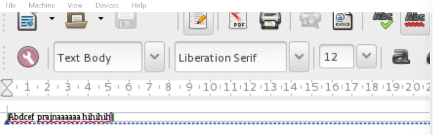
        2. [3 Point] Hapus abcdef. Save test_1.doc
        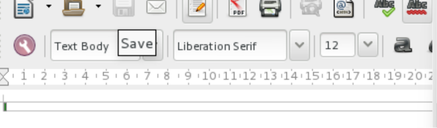
     

    - [3 Point] Lakukan hash SHA256, SHA512 dan MD5 untuk file test_1.doc. Screenshot nilai hash dari file test_1.doc.
     
    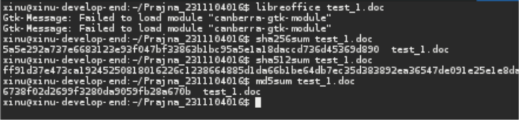

    - [3 Point] Hasil pengamatan apa yang diperoleh? Jelaskan alasannya!
     
    Nilai hash berbeda meskipun isi teks dikembalikan seperti semula. Ini karena file .doc menyimpan metadata seperti tanggal edit, jumlah revisi, dan informasi penulis. Saat file disimpan ulang, metadata berubah → isi file secara keseluruhan berubah → nilai hash berbeda.

4. Konfidensialitas: encfs [27 Point]
Encfs adalah tool untuk melakukan mount dan membuat file system yang terenkripsi. Cara kerjanya adalah sebagai berikut. Ada 2 folder yang akan dibuat, dua folder tersebut saling terkait. Satu folder merupakan folder yang tidak terenkripsi, folder lainnya merupakan hasil enkripsi dari folder pertama.
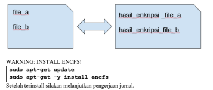
 Install dulu
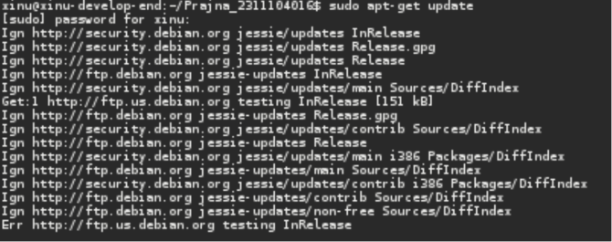
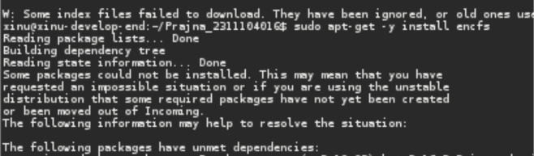

    - [5 Point] Jalankan perintah berikut: 
    encfs ~/folder_anda/folder_terenkripsi ~/folder_anda/folder_normal
    Pilih y (enter), pilih y (enter), enter, kemudian buatlah password. Ingatlah password yang dibuat. Setelah selesai, perhatikan bahwa telah muncul folder bernama folder_normal dan folder_terenkripsi.
     
   

    - [5 Point] Copy dua atau tiga buah file (file apa saja) ke  folder_normal. Amati dan tulis hasil observasi Anda pada folder_terenkripsi!
     

    - [5 Point] Hapus salah satu file (bebas) pada folder_terenkripsi. Amati dan tulis hasil observasi Anda pada folder_normal!
     

    - [5 Point] Lakukan umount dengan perintah: Fusermount -u ~/folder_anda/folder_normal. Amati dan tulis hasil observasi Anda pada folder_normal dan folder_terenkripsi
     

    - [7 Point] Buatlah folder baru bernama folder_sembarang. Lakukan perintah berikut ini: encfs ~/folder_anda/folder_terenkripsi ~/folder_anda/folder_sembarang. Amati dan tulis hasil observasi Anda!

5. Konfidensialitas: gpg [30 Point]
    - [5 Point] Membuat kunci publik dan privat.
     
    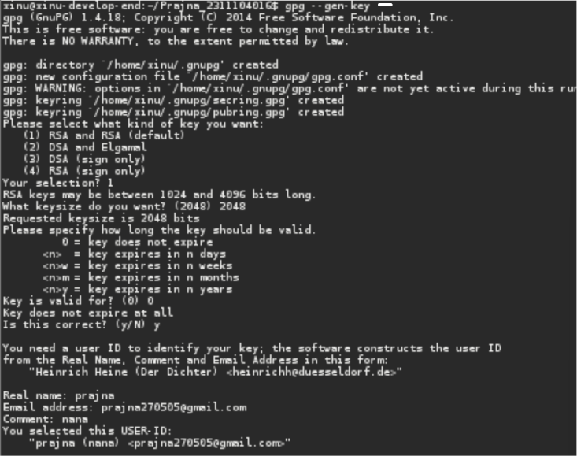

    - [5 Point] Hasil publickey dan privatekey ada di folder ~/.gnupg. Privatekey tidak boleh keluar dari komputer ini dan hanya Anda saja yang dapat mengaksesnya. Kunci publik akan dibagikan kepada seluruh dunia atau untuk orang yang Anda inginkan saja. Kunci publik adalah pubring.gpg dan kunci private adalah secring.gpg Lakukan perintah berikut ini untuk mengetahui daftar key yang Anda punya dan fingerprint kunci yang Anda punya!
     
    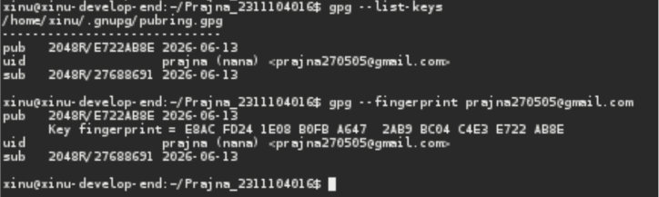

    - [5 Point] Export kunci publik Anda. Jalankan perintah ini:
File mypublic_key.asc adalah file yang akan dibagikan kepada teman-teman Anda. Teman Anda akan menggunakan kunci publik Anda jika ingin mengirim pesan rahasia kepada Anda. Hanya Anda yang dapat membaca pesan tersebut karena hanya mempunyai kunci privat yang bersesuaian dengan kunci publik Anda.
 
i. Rename mypublic_key.asc menjadi nim_anda.asc, Contoh: 130118xxxx.asc
 
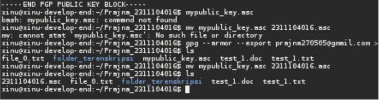

ii. Taruh file nim_anda.asc ke folder pada link berikut: http://tiny.
cc/SisopNomor5C
 

## Referensi

1. https://share.google/di5IoOeGs83Fkxl0c (oracle vm virtual box)
2. https://id.wikipedia.org/wiki/XNU (xinu)
